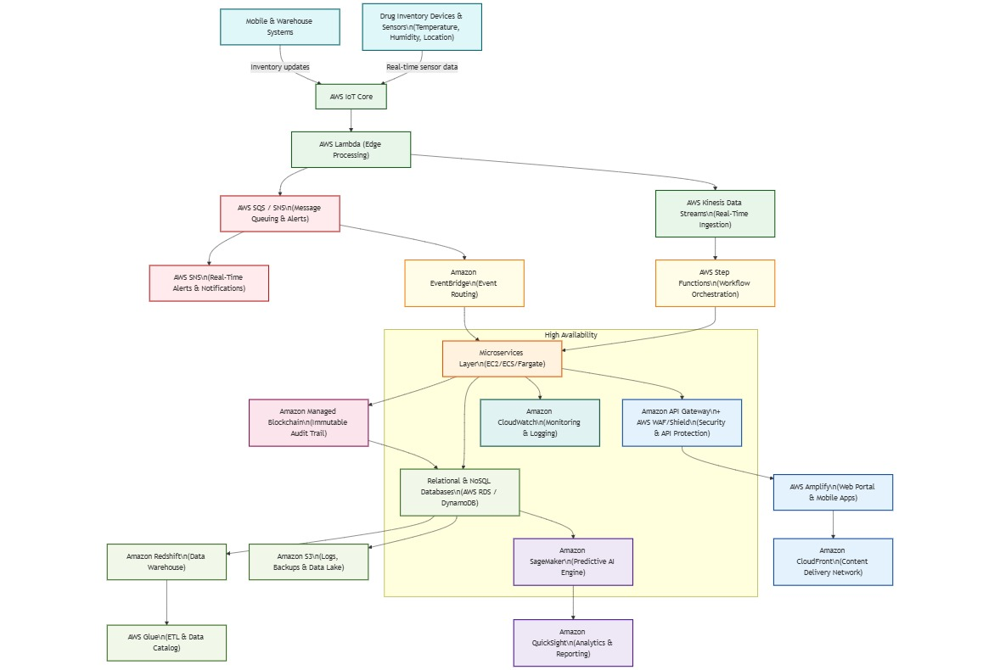

# AI-Driven Cloud Drug Management System

**Runner-Up at Hack MIT-WPU'25**
Cloud + AI + IoT System Design Project

---

## Problem Statement

Develop a cloud-based system to monitor drug inventory, ensure availability, track supply chains, and predict shortages using AI.

---

## System Architecture

### 1. Workflow

---

### 2. Data Flow

---

### 3. Deployment

---

### 4. Cloud Architecture

---

## System Pipeline

1. Sensors collect real-time data (temperature, location, stock)
2. AWS IoT Core ingests data
3. AWS Lambda processes data
4. AWS Kinesis handles real-time streaming
5. Data stored in RDS/DynamoDB
6. AWS SageMaker performs predictions
7. SNS/SQS sends alerts
8. AWS Amplify provides dashboard

---

## Tech Stack

* AWS (IoT Core, Lambda, Kinesis, S3, RDS, SageMaker, SNS, Amplify)
* Cloud Architecture Design
* AI/ML (planned)

---

## Key Features

* Real-time drug inventory tracking
* Predictive analytics for shortages
* Automated alert system
* Scalable cloud infrastructure

---

## Achievement

Runner-Up at Hack MIT_WPU'25(AWS Reforge)

---

## Current Status

* System Design Completed
* Implementation in Progress

---

## Future Work

* Build ML model for prediction
* Develop backend APIs

